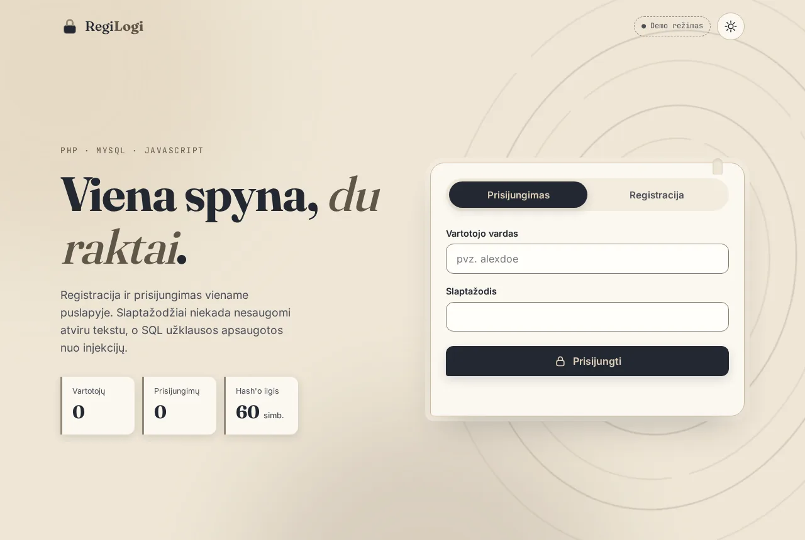

# 🔐 RegiLogi: registracija ir prisijungimas su PHP

Registracijos ir prisijungimo forma viename puslapyje. Slaptažodžiai saugomi tik kaip hash'as, o SQL užklausos apsaugotos nuo injekcijų.

**[▶ Gyva demo versija](https://brutall100.github.io/php-register-login-lt/)** · **[📂 Kodas](https://github.com/brutall100/php-register-login-lt)**



## Apie projektą

Tai mano PHP mokymosi projektas. Iš pradžių jis buvo paprasta forma, kuri slaptažodžius saugojo atviru tekstu. Dabar tai saugi ir moderni versija:

- **PHP + MySQL** dalis veikia tikrame serveryje tavo kompiuteryje.
- **Demo režimas** veikia GitHub Pages svetainėje be jokio serverio: vartotojai saugomi tavo naršyklėje (`localStorage`).

Puslapis pats atpažįsta, kuris režimas veikia, ir parodo tai ženkliuku viršuje: `● PHP serveris` arba `● Demo režimas`.

## Funkcijos

- 📝 Registracija su vardo, el. pašto ir slaptažodžio tikrinimu.
- 🔑 Prisijungimas, sesija ir atsijungimas.
- 🧂 Slaptažodžiai niekada nesaugomi atviru tekstu: serveryje naudojamas `password_hash()` (bcrypt), demo režime PBKDF2 su druska.
- 🛡️ SQL užklausos su placeholder'iais (`?`), todėl SQL injekcija nesuveikia.
- 🌗 Šviesus ir tamsus režimai. Pasirinkimas įsimenamas, puslapis kraunantis nemirga.
- 📊 Slaptažodžio stiprumo juosta ir skaičiai, kurie „suskaičiuoja“.
- 🔒 Spynos ikona mygtuke, kuri „atsirakina“ sėkmingai prisijungus. Mygtukai turi bangelės (ripple) efektą.
- 📱 Veikia telefone (nuo 390px pločio).
- ♿ Prieinamumas: „Pereiti prie turinio“ nuoroda, `<label>` kiekvienam laukeliui, matomas fokusas, `prefers-reduced-motion` išjungia judėjimą.

## Sukurta su

| Dalis | Technologija |
|---|---|
| Struktūra | HTML5 |
| Dizainas | CSS (kintamieji `:root`, be bibliotekų) |
| Logika | JavaScript (be bibliotekų), Web Crypto API |
| Serveris | PHP 8, PDO |
| Duomenų bazė | MySQL / MariaDB |

**Spalvų paletė**

| Spalva | HEX | Kur naudojama |
|---|---|---|
|  Naktis | `#222831` | Tamsus fonas, šviesaus režimo tekstas ir mygtukai |
|  Grafitas | `#393E46` | Kortelių paviršiai tamsiame režime |
|  Taupe | `#948979` | Rėmeliai, linijos, švytėjimas |
|  Kreminė | `#DFD0B8` | Šviesus fonas, tamsaus režimo tekstas ir mygtukai |

Tekstui naudojamas tamsesnis taupe atspalvis `#5E5648`. Jo kontrastas 6.2:1, o originalios `#948979` ant kreminio fono būtų tik 2.3:1.

**Šriftai (Google Fonts):** [Fraunces](https://fonts.google.com/specimen/Fraunces) antraštėms, [Inter](https://fonts.google.com/specimen/Inter) tekstui, [JetBrains Mono](https://fonts.google.com/specimen/JetBrains+Mono) kodui.

## Ko išmokau

- **Kodėl slaptažodžio negalima saugoti atviru tekstu.** `password_hash()` sukuria kodą, kurio atgal atversti neįmanoma, o `password_verify()` tik patikrina, ar slaptažodis tinka.
- **Kaip veikia SQL injekcija** ir kodėl paruoštos užklausos (`prepare` + `?`) ją sustabdo.
- **Kaip laikyti paslaptis aplinkos kintamuosiuose** (`.env`), kad jos nepatektų į GitHub.
- **Kaip viena sąsaja gali veikti su dviem „backend'ais“**: su tikru serveriu ir su naršyklės saugykla.
- **WCAG kontrastas**: kaip patikrinti spalvas skaičiais ir kada spalvą reikia patamsinti.

## Paleisk savo kompiuteryje

### 1 variantas: tik demo (be PHP)

```bash
git clone https://github.com/brutall100/php-register-login-lt.git
cd php-register-login-lt
npx serve .          # arba: python3 -m http.server 8080
```

Atsidaryk naršyklėje adresą, kurį parodys komanda. Ženkliukas rodys `● Demo režimas`.

### 2 variantas: tikras PHP + MySQL serveris

1. Sukurk duomenų bazę ir lentelę:
   ```bash
   mysql -u root -p < api/schema.sql
   ```
2. Nukopijuok nustatymų pavyzdį ir įrašyk savo duomenis:
   ```bash
   cp .env.example .env
   ```
   `.env` failas į GitHub nekeliauja (jis įrašytas į `.gitignore`).
3. Paleisk PHP serverį:
   ```bash
   php -S localhost:8000
   ```
4. Atsidaryk <http://localhost:8000>. Ženkliukas rodys `● PHP serveris`.

> Neturi MySQL? Išbandyti galima ir su SQLite: į `.env` įrašyk `DB_DSN=sqlite:/kelias/iki/users.sqlite` ir susikurk tą pačią `users` lentelę.

## Projekto struktūra

```
php-register-login-lt/
├── index.html          # puslapis
├── css/
│   └── style.css       # visas dizainas, spalvos viršuje (:root)
├── js/
│   ├── theme-init.js   # pritaiko temą dar prieš piešiant puslapį
│   ├── demo-store.js   # demo režimas: vartotojai naršyklėje
│   └── app.js          # formos, temos, animacijos
├── api/
│   ├── auth.php        # JSON API: register, login, logout, me, stats
│   ├── config.php      # PDO prisijungimas iš aplinkos kintamųjų
│   ├── schema.sql      # MySQL lentelė
│   └── .htaccess       # slepia config ir schema failus (Apache)
├── images/
│   └── favicon.svg
├── docs/
│   └── screenshot.webp
├── .env.example
└── LICENSE
```

## Autorystė

- Kodas ir dizainas: [brutall100](https://github.com/brutall100)
- Šriftai: Fraunces (Undercase Type), Inter (Rasmus Andersson), JetBrains Mono (JetBrains), visi per Google Fonts, licencija SIL Open Font License
- Licencija: [MIT](LICENSE)
